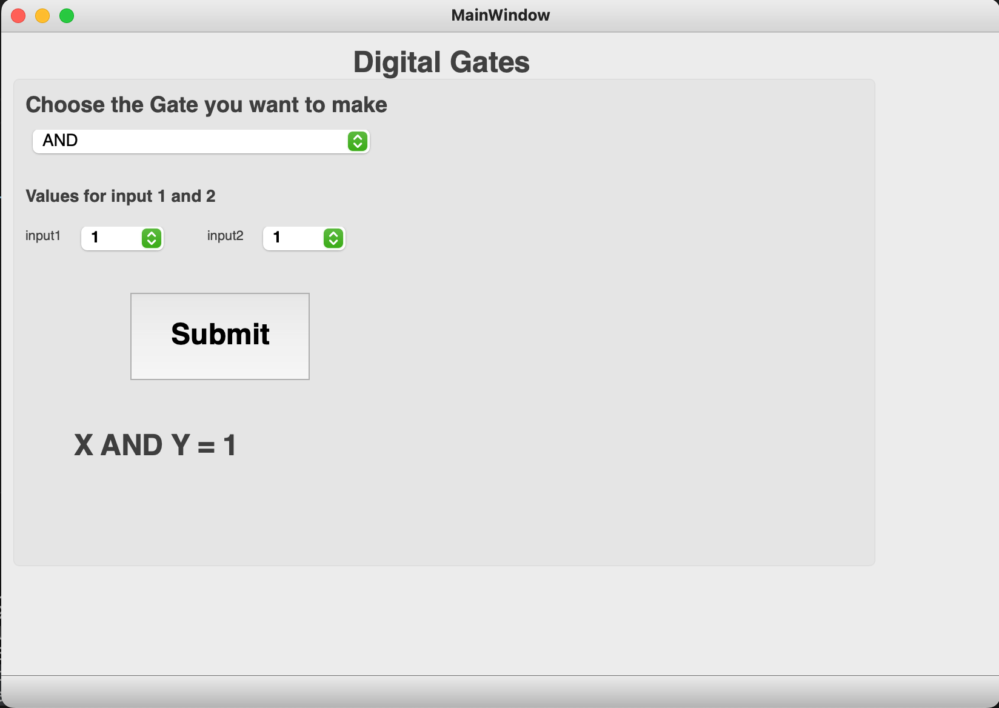
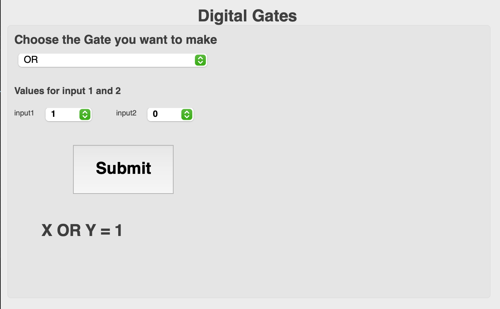
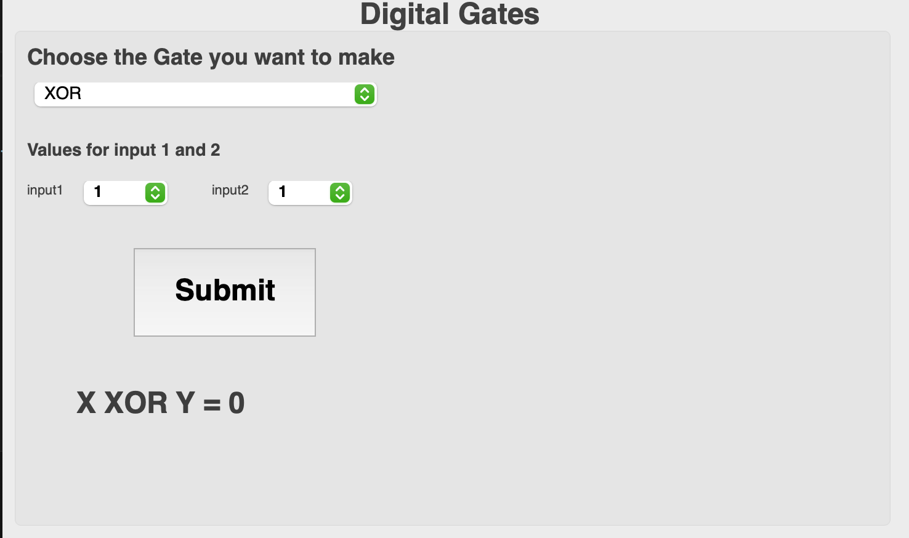

# Convert ui file into the python file 
 - pyuic5 -x {uifilename} -o {newconvertedfilename}

# popup button icon style
  - Critical
  - Warning
  - Information
  - Question

# create the iconic style of digital gates that used for the simualtions

## AND gate

## OR gate:

## XOR gate

